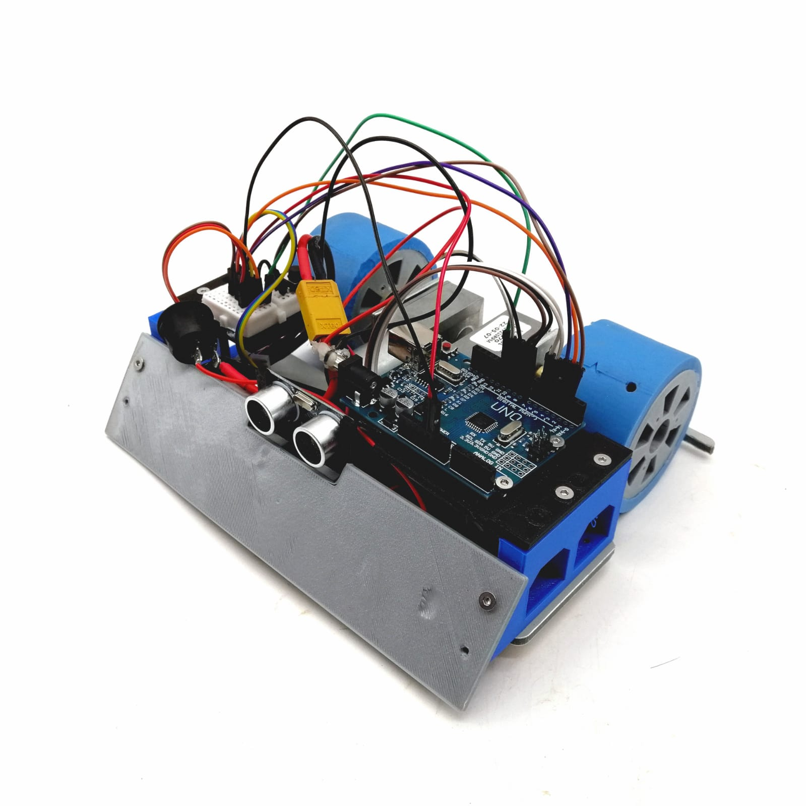
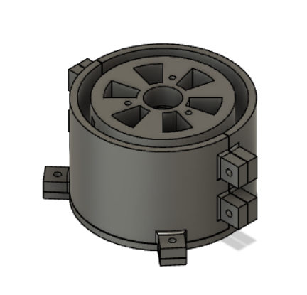
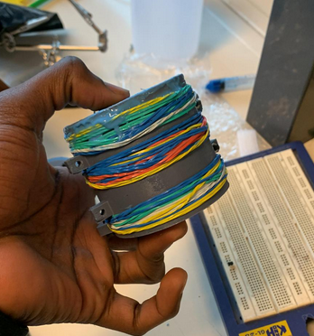
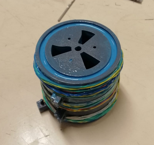
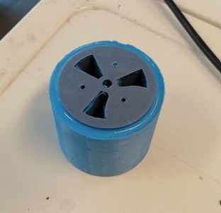
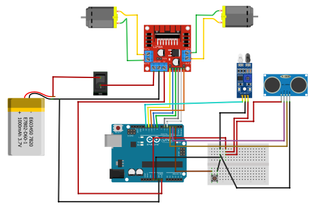

# thorkellbot

## Table of contents

1. [Introduction](#intro)
2. [CAD files](#cad)
3. [Bill of materials](#bom)
4. [Manufacturing processes](#manufacturing-processes)
5. [Wiring](#wiring)
6. [Code](#code)

## Introduction<a name="intro"> <a/>

This repository serves as documentation for a Sumobot Project, developed for the 'Fabricación Digital' course, of the Department of Mechanical Engineering, Universidad de Chile.

The assignment consisted of the design and fabrication of a robot for Robot-Sumo competitions, specifically ours had fit in a 20cm cube, and weigh no more than 1kg. You can read more about these competitions [here](https://www.fsi.co.jp/sumo-e/out/outc0000.html).

This project was developed by Joan Núñez, Joseph-Jowel Sabin and Gustavo Rivera.

In this repo we showcase our design, indicate everything needed to replicate it, comment on the fabrication process of our prototype and explain the robot's routine.

### Demos
You can see our prototype working in the following videos:

## CAD Files<a name="cad"> <a/>

You can access the current version of our CAD files on GrabCAD, on the following link: https://grabcad.com/library/thorkell-sumobot-2

## Bill of materials<a name="bom"> <a/>

You can find it on [src/docs/thorkellbom.xlsx](src/docs/thorkellbom.xlsx).

## Manufacturing processes

3 main manufacturing processes were used in this project: CNC Machining, 3D Printing and Polyurethane Casting. 

### CNC Machining
Using Fusion 360's Manufacturing Environment, a CAM Program was made for cutting the ACP Chassis, using a slotting bit and different drill bits for 2D Contours and Drilling operations. 
If you don't have access to this material, it can also be made out of wood or 3D Printed, taking into account the weight differences. 

The following operation parameters were used on a ShopBot PRSAlpha CNC Router:

#### Contouring:
Tool: 3/16'' 2 flute straight router bit.
| Parameter                 | Value  |
|---------------------------|--------|
| Spindle RPM               | 6000   |
| Cutting Feedrate [mm/min] | 690    |
| Feed per tooth [mm]       | 0.0575 |
| Ramp Feedrate [mm/min]    | 230    |

#### Drilling:
Tool: 3 mm drill bit
| Parameter                 | Value  |
|---------------------------|--------|
| Spindle RPM               | 6000   |
| Plunge feedrate [mm/min]  | 300    |

### 3D Printing
3D Printing was used for manufacturing the robot's body kit, the adapter for mounting the omni-wheel, as well as the main wheel's molds and 'cores'. 

### Casting
Finally, the wheels were casted using "Smoothon Smooth-Sil 950", but there's cheaper ways of doing this, as seen [here](https://www.instructables.com/Grippy-Hollow-Silicone-Tires-for-Robots-and-RC/) and [here](https://www.youtube.com/watch?v=_7dLUU1tf58). There's many other resources found on the internet about casting custom wheels with readily available materials. 

The mould was designed to be reusable, and also to secure alignment of the wheel during the casting process, and also maintaining the casted tire in place with the included slots in the wheel, considering the poor adhesion of silicone to PLA. 

You can see it assembled in cad in the following picture: 

Here are some pictures of the curing process, and finished result:

**Note that these wheels are different than the final ones. That's because they were re printed, and the silicone cut and reused for smaller wheels.** 

When using, make sure to affix the wheel core to the moulds bottom side using the three bolt holes with 3mm bolts, and tighten the two mould halfs if possible with bolts, or in our case rubber bands, since our bolt plates broke. 

## Wiring

In the following picture, you can see a diagram of our project's electronics: 

In order to optimize ground and 5v pin usage, we used a breadboard, but since we needed to stay within 1kg, we cut a standard breadboard to just 10 rows with a saw.

We also used a 11.1V LiPo Battery, in order to maximize the motor's power capacity.

## Assembly

For assembly we reccomend going from the bottom up. First mounting the DC Motor brackets, and aligning them as good as you can. Then, mounting the caster wheel with its adapter, and also the IR Sensor with its spacer, all with 16mm m3 bolts and nuts. 
Then, we secured the l298n motor driver with cable ties to the chassis, and did the same to the battery. 

If you include a switch, you need to solder the female battery connector's positive wire to it, and the other end insert it into the l298N's 12V port. The ground you connect to the chip's gnd port, and from that same port connect a gnd that will go to the arduino. From the chip's 5V port you get the positive power wire for the arduino. Here you can use a dc plug, or connect to the Vin pin. 

Then, we mount the bodykit's lateral supports, wire the tracker sensor, and wire the ultrasonic sensor, after you mount it to the weapon's included support. These all use 10mm m3 bolts. To mount the Ultrasonic sensor to its support piece, use the 2 mm screws.

With that done, all that's left is install the weapon, install the arduino and protoboard support plates with 10mm m3 bolts and wire the rest of the system up. To mount the arduino to the plate you also use m3 bolts, making sure not to tighten in too much, and the protoboard you can mount with the included adhesive.

For the wheels, press fit the hex couplings into the wheel cores, and install the other end to the motor shafts, tightening the set screw on the flat side. 

## Code

You can find it documented on [src/thorkell/thorkell.ino](src/thorkell/thorkell.ino).

### Requirements

* Arduino IDE (or some way to load the program into the arduino board)
* Button library (we used the one made by Michael Adams)
    * We installed it via the Arduino IDE.

### Routine 

The code routine is relatively basic, and we acknowledge the fact that this is the main pending task going into the future, if this robot was to actually compete. 

It basically has 2 states, "battle" and "idle". When the button is pressed, it waits 5 seconds and toggles this state. 

When in idle mode, all motors are off, and no detection routines run.

When in battle mode, there's basically 3 routes:

1. If the border of the arena is detected (tracker sensor measures 1/HIGH), the robot goes backwards until it stops detecting the line. 

2. If no line is detected, and the ultrasonic sensor measures a distance higher than 35 cm, it enters 'search' mode. This consists on the robot rotating on its own axis, by powering both motors in different directions, at a pwm value lower than max (we used 180 out of 255).

3. If the ultrasonic sensor measures a distance lower than 35 cm, it goes charging forward towards the detected target. 

